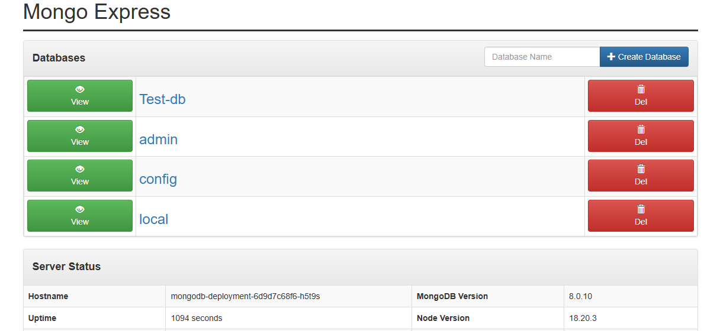

# mongodbappK8S
# You will need to create your own secrets file
# run "kubectl log your mongoexpress application" to check if your mongo express service is connected. 

"
apiVersion: v1
kind: Secret
metadata:
  name:  mongodb-secret
type: opaque #othertypes are tls 
data:
  mongo-root-username: 
  mongo-root-password:  
  "
#

# run "minikube service <servicename>"   To start the mongo express if you are using minikube

You should be able to interact with the mongoexpress DB and create a new DB as afterwards.

When you create a new DB a request is sent from the mongoexpress-service to the mongoexpress-pod 
mongoexpress-pod speaks to the mongoDB-internal-service who speaks to the mongoDB-pod. 

I can be reached on deyemi@apicemglobal.org if you have any questions. 

I have updated the project to use an Ingress. The Ingress acts as the first point of contact before reaching a service, providing an additional layer of control and security in a Kubernetes cluster.

When using Minikube with a LoadBalancer service, remember to run minikube tunnel in a separate terminal to expose the LoadBalancer IP locally, and update your /etc/hosts file with the corresponding IP address to access services via hostnames.

Happy coding.

